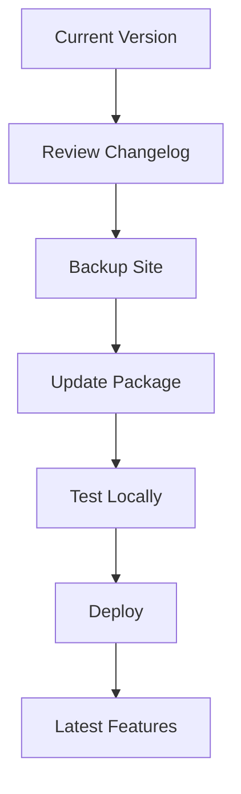

## Overview

Stay current with Ryan Documentation releases. You receive new features, performance enhancements, and bug fixes through regular updates. Check this changelog to understand changes and upgrade instructions.

<Callout kind="info">
  Subscribe to our RSS feed or join the Discord community to get notified of new releases automatically.
</Callout>

<Columns cols={3}>
  <Card title="Latest Release" icon="zap" href="#latest">
    v2.0.0 - Major component upgrades and API improvements.
  </Card>
  <Card title="Beta Features" icon="sparkles" href="#beta">
    Explore upcoming changes in v2.1.0-beta.
  </Card>
  <Card title="Upgrade Guide" icon="book-open" href="#upgrade">
    Step-by-step instructions to update your docs site.
  </Card>
</Columns>

## Recent Releases

Review the most recent versions below. Each release includes detailed changelogs grouped by category.

<Update label="2024-11-05" description="v2.0.0" tags={["feature", "breaking"]}>

## Breaking Changes

- Removed legacy `<Mermaid>` component support. Migrate to standard `mermaid` code blocks.
- Updated attribute syntax: All strings now require double quotes.

## New Features

- Added `<Video>` and `<Iframe>` components for rich media embeds.
- Introduced `<ParamField>` and `<ResponseField>` for API documentation.
- Enhanced `<Tabs>` with icon support for better platform-specific guides.

## Improvements

- Improved parsing error handling for nested code blocks.
- Faster rendering with optimized JSX hydration.

</Update>

<Update label="2024-10-15" description="v1.5.0" tags={["feature", "bugfix"]}>

## New Features

- New `<Columns>` component for responsive grid layouts.
- `<Steps>` now supports custom icons and title types.

## Bug Fixes

- Fixed heading hierarchy validation to prevent H1 usage in body content.
- Resolved special character escaping issues with `{` and `<` in prose.
- Corrected nested code block rendering using 4 backticks.

## Improvements

- Better accessibility with required `alt` attributes on `<Image>`.

</Update>

<Update label="2024-09-01" description="v1.4.0" tags={["bugfix", "improvement"]}>

## Bug Fixes

- Patched self-closing component errors for containers like `<Callout>`.
- Fixed attribute parsing for arrays like `tags={["feature"]}`.

## Improvements

- Added Lucide icon validation to prevent invalid names.
- Optimized frontmatter parsing with no blank line tolerance.

</Update>

## Upgrade Guide

Follow these steps to upgrade Ryan Documentation to the latest version.

<Steps>
  <Step title="Backup Your Site" icon="database">
    Create a full backup of your `docs/` directory and any custom MDX files.
  </Step>
  <Step title="Update Dependencies" icon="package">
    Run the update command for your package manager.
    
    <CodeGroup tabs="npm,yarn,pnpm">
      ```bash
      npm install ryan-docs@latest
      ```
      ```bash
      yarn add ryan-docs@latest
      ```
      ```bash
      pnpm add ryan-docs@latest
      ```
    </CodeGroup>
  </Step>
  <Step title="Review Breaking Changes" icon="alert-triangle">
    Check the `<Update>` sections above for migration notes, especially v2.0.0.
  </Step>
  <Step title="Test Locally" icon="play">
    Build and preview: `npm run docs:dev`.
    
    Verify no parsing errors appear in the console.
  </Step>
  <Step title="Deploy" icon="rocket">
    Push changes and redeploy your documentation site.
  </Step>
</Steps>

<Tabs>
  <Tab title="Common Issues" icon="help-circle">
    
    ## Parsing Errors
    
    Ensure you escape special characters like `{variable}` and `<Component>`.
    
    <Expandable title="Example Fix" default-open="true">
      
      **Before (Error):**
      ````markdown
      Use {API_KEY} here.
      ````
      
      **After (Fixed):**
      ```markdown
      Use `API_KEY` here.
      ```
      
    </Expandable>
    
  </Tab>
  <Tab title="Contributing" icon="github">
    
    Found a bug? Submit pull requests to our repository.
    
    <Image
      src="https://example.com/contribute.png"
      alt="Contribution workflow diagram"
      width="600"
      height="400"
    />
    
  </Tab>
</Tabs>



<Callout kind="tip">
  After upgrading, validate your MDX files using the built-in linter to catch common syntax issues early.
</Callout>