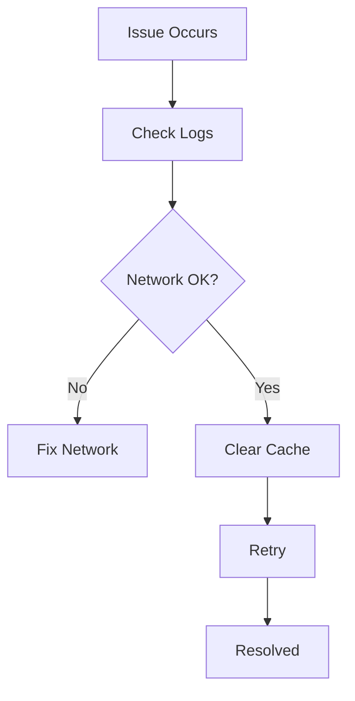

## Account and Billing

Ryan Documentation offers flexible plans for individuals and teams. Use the expandable sections below to find answers to common account-related questions.

<ExpandableGroup>

<Expandable title="How do I create an account?">

To create an account, visit `https://ryan-docs.com/signup` and provide your email, name, and a secure password. Verify your email to activate the account.

<Steps>
  <Step title="Sign Up" icon="user-plus">
    Navigate to the signup page.
  </Step>
  <Step title="Enter Details" icon="edit">
    Fill in your information.
  </Step>
  <Step title="Verify Email" icon="mail">
    Check your inbox and click the verification link.
  </Step>
</Steps>

</Expandable>

<Expandable title="What payment methods do you accept?" default-open="true">

We accept major credit cards (Visa, Mastercard, American Express), PayPal, and bank transfers for enterprise plans.

| Method          | Free Plan | Pro Plan | Enterprise |
|-----------------|-----------|----------|------------|
| Credit Card     | No        | Yes      | Yes        |
| PayPal          | No        | Yes      | Yes        |
| Bank Transfer   | No        | No       | Yes        |

<Callout kind="info">
  Upgrade your plan anytime from the billing dashboard at `https://ryan-docs.com/account/billing`.
</Callout>

</Expandable>

<Expandable title="How do I cancel my subscription?">

Log in to your account dashboard, navigate to Billing > Subscriptions, and click Cancel. You retain access until the end of the billing period.

</Expandable>

</ExpandableGroup>

## Common Issues

Troubleshoot typical problems you might encounter with Ryan Documentation.

<Tabs>
  <Tab title="Installation Errors" icon="terminal">

If you face installation issues, check your environment.

<CodeGroup tabs="npm,yarn">
  ```bash
  npm install ryan-docs-cli
  ```
  ```bash
  yarn add ryan-docs-cli
  ```
</CodeGroup>

<Callout kind="tip">
  Ensure Node.js version is `>=18`. Run `node --version` to verify.
</Callout>

  </Tab>
  <Tab title="Sync Failures" icon="cloud-off">

Sync issues often stem from network problems or invalid tokens.

<Steps>
  <Step title="Check Token" icon="key">
    Verify your sync token in settings.
  </Step>
  <Step title="Clear Cache" icon="trash-2">
    Run `ryan-docs cache clear`.
  </Step>
  <Step title="Retry Sync" icon="refresh-cw">
    Execute `ryan-docs sync`.
  </Step>
</Steps>

  </Tab>
</Tabs>



## Best Practices

Follow these guidelines to get the most from Ryan Documentation.

<Columns cols={2}>
  <Card title="Organize Content" icon="folder" href="#">
    Group pages into folders by feature or team. Use consistent naming like `api-v1/` or `user-guide/`.
  </Card>
  <Card title="Version Control" icon="git-branch" href="#">
    Integrate with GitHub for automatic deployments on push.
  </Card>
  <Card title="Search Optimization" icon="search" href="#">
    Add descriptive titles and use `keywords` in frontmatter for better discoverability.
  </Card>
  <Card title="Performance Tips" icon="zap" href="#">
    Compress images and limit nested components to under 10 per page.
  </Card>
</Columns>

<Expandable title="Advanced Configuration">

Customize your docs with a `ryan.config.js` file.

````jsx
// ryan.config.js
module.exports = {
  brandColor: '#3B82F6',
  navLinks: [
    { title: 'Home', href: '/' },
    { title: 'API', href: '/api' },
  ],
};
````

</Expandable>

<Callout kind="success">
  Regularly back up your documentation space to avoid data loss.
</Callout>