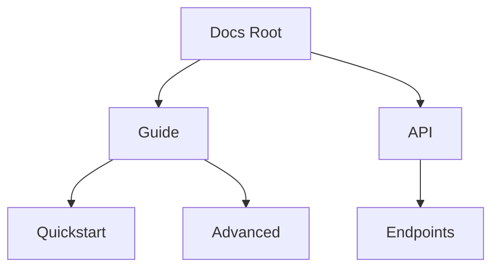

## Overview

Ryan provides a flexible system for building and maintaining your project documentation. You create pages, organize them into hierarchies, and collaborate with your team seamlessly. This guide covers the essentials to get you started.

<Callout kind="tip">
  Start with the web editor for quick changes, or use the CLI for advanced workflows.
</Callout>

## Creating and Editing Pages

Begin by creating new documentation pages directly in your project.

<Steps>
  <Step title="Create a New Page" icon="file-plus">
    Navigate to your docs directory and run the Ryan CLI command:

    ```bash
    ryan new page my-guide.mdx
    ```

    This generates a new MDX file with frontmatter.
  </Step>

  <Step title="Add Frontmatter" icon="settings">
    Edit the YAML frontmatter at the top of the file:

````mdx
```yaml
---
title: My Guide
description: A brief overview.
---
```
````

  </Step>

  <Step title="Preview Changes" icon="eye">
    Run the preview server:

    ```bash
    ryan dev
    ```

    View your docs at `http://localhost:3000`.
  </Step>
</Steps>

Edit pages using your preferred method.

<Tabs>
  <Tab title="Web Editor" icon="globe">
    Access the built-in editor via the dashboard. Make real-time changes and preview instantly.
  </Tab>

  <Tab title="CLI + VS Code" icon="code">
    Use your local editor for version control integration.

    <CodeGroup tabs="Markdown,MDX">
```markdown
# Welcome

Content here.
```
```mdx
## Structured Content

Use components like `<Callout>`.
```
    </CodeGroup>
  </Tab>
</Tabs>

## Organizing Content Hierarchies

Structure your docs with folders, frontmatter, and navigation configs for intuitive navigation.

<Columns cols={3}>
  <Card title="Folders" icon="folder" href="#">
    Use filesystem folders to mirror your hierarchy.
  </Card>

  <Card title="Frontmatter" icon="tag" href="#">
    Set `order` and `sidebar` in YAML for custom positioning.
  </Card>

  <Card title="Navigation" icon="menu" href="#">
    Configure sidebars in `ryan.config.js`.
  </Card>
</Columns>

Example hierarchy:

| Path                  | Title             | Order |
|-----------------------|-------------------|-------|
| /guide/               | Guides            | 1     |
| /guide/quickstart.mdx | Quickstart        | 1     |
| /guide/advanced.mdx   | Advanced Topics   | 2     |
| /api/                 | API Reference     | 2     |

Visualize your structure:



## Collaboration and Sharing

Invite team members and share your docs efficiently.

<ExpandableGroup>
  <Expandable title="Role-Based Access" default-open="true">
    Assign roles like Viewer, Editor, or Admin via the dashboard. Editors can create and modify pages without full repo access.
  </Expandable>

  <Expandable title="Version Control">
    All changes commit to Git automatically. Use branches for drafts:

    ```bash
    git checkout -b feature/new-guide
    ryan new page draft.mdx
    git add .
    git commit -m "Add draft guide"
    ```
  </Expandable>

  <Expandable title="Public Sharing">
    Deploy to a custom domain or share preview links. Set visibility in project settings.
  </Expandable>
</ExpandableGroup>

<Callout kind="success">
  Your docs update live on every push. Collaborate without merge conflicts using Ryan's conflict resolution.
</Callout>